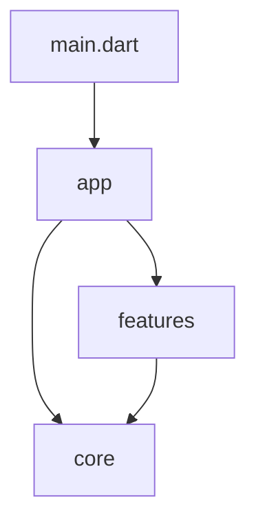

# FlutterKaigi 2023 official website

## Development

We will deliver sessions related to FlutterKaigi in accordance with [Figma](https://www.figma.com/file/LsVB4KlIMXD4Z1FfB8KyuU/FlutterKaigi-Web-2023).

### Setup

This project uses [Flutter beta channel](https://github.com/flutter/flutter/wiki/Roadmap#releases).

1. [Install fvm](https://fvm.app/docs/getting_started/installation).
1. Move to project root directory, and run `fvm install` command.
1. Run `fvm flutter pub get` command.
1. Set up IDE to use fvm.
    - If you use [VSCode](https://code.visualstudio.com/), already set up.
    - If you use [Android Studio](https://developer.android.com/studio), please see [fvm document](https://fvm.app/docs/getting_started/configuration#android-studio).

### Run app

A Run Configuration is set up to run this app.

Please check:
    - `.vscode/launch.json` for VS Code
    - `.run/~.run.xml` for IntelliJ IDEA or Android Studio.

### Contributing

We always welcome all contributions! See [CONTRIBUTING.md](./CONTRIBUTING.md) for more information.

For Japanese, please see [CONTRIBUTING.ja.md](./CONTRIBUTING.ja.md).

### Branch Rules

We would be happy if you could create a branch with the following rules

| branch prefix | label |
| -- | -- |
| `feature/*` | `feature` |
| `fix/*`, `bugfix/*` | `bug` |
| `improvement/*`, `improve/*`, `migrate/*` | `improve` |

### Tech Stacks

- [Flutter](https://flutter.dev/)
- [Flutter Web](https://docs.flutter.dev/deployment/web)
- [GitHub Pages](https://docs.github.com/ja/pages/getting-started-with-github-pages/about-github-pages)
- [Codemagic Static Pages](https://docs.codemagic.io/flutter-publishing/publishing-to-codemagic-static-pages/)

### Directory Structure

```text
./lib
├── app
├── core
│   ├── components
│   ├── gen
│   ├── l10n
│   └── theme
└── features
    ├── ...
    │   ├── data
    │   └── ui
    └── ...
        ├── data
        └── ui
```

### Architecture



## Thanks

Thank you for contributing!

### Contributors

GitHub: [Contributors](https://github.com/FlutterKaigi/2023/graphs/contributors)
